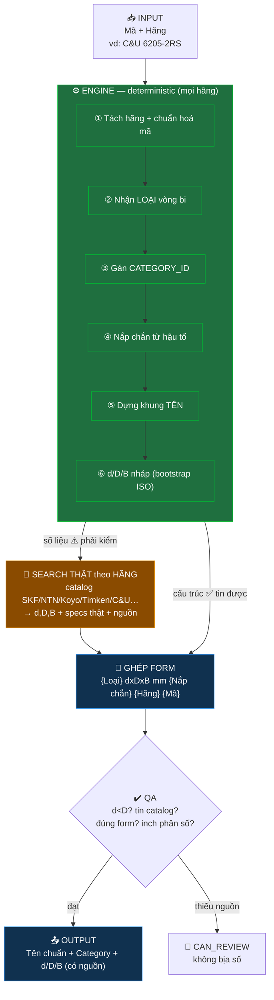

# 🗺️ Bản đồ Skill: Bearing Naming & Standardizer

## Sơ đồ tổng quát (ASCII)

```
 ┌───────────────────────────────────────────┐
 INPUT │ File chỉ có: MÃ + (HÃNG) │
 │ vd: "C&U 6205-2RS" · "NTN NF305" │
 └────────────────────┬──────────────────────┘
 │
 ┌──────────────────────────▼───────────────────────────┐
 │ ⚙️ ENGINE — DETERMINISTIC (đúng MỌI hãng) │
 │ bearing_engine.py + dimension_tables + category_map │
 ├───────────────────────────────────────────────────────┤
 │ ① Tách HÃNG + chuẩn hoá MÃ (giữ hậu tố: 6205-2RS) │
 │ ② Nhận LOẠI vòng bi (cầu/côn/đũa/chà/kim…) │
 │ ③ Gán CATEGORY_ID (category_map.json) │
 │ ④ Suy NẮP CHẮN từ hậu tố (ZZ→2 Nắp Thép …) │
 │ ⑤ Dựng KHUNG TÊN (template) │
 │ ⑥ (nháp) d/D/B nếu mã ISO mét chuẩn ◄─ chỉ BOOTSTRAP│
 └───────────────┬───────────────────────┬───────────────┘
 phần CẤU TRÚC │ │ phần SỐ LIỆU
 (loại, category, form) │ │ (d/D/B, specs)
 ✅ tin được │ │ ⚠️ PHẢI kiểm
 │ ▼
 │ ┌────────────────────────────────────┐
 │ │ 🔎 SEARCH THẬT theo HÃNG (bắt buộc)│
 │ │ catalog chính hãng: │
 │ │ SKF·NTN·Koyo·NSK·FAG·Timken·C&U… │
 │ │ → lấy d, D, B/T + specs THẬT │
 │ │ của đúng hậu tố/series │
 │ │ → inch đổi ×25.4, ghi NGUỒN │
 │ └────────────────┬───────────────────┘
 │ │
 └───────────┬───────────┘
 ▼
 ┌─────────────────────────────────────────────┐
 │ 🧩 GHÉP THEO FORM CHUẨN │
 │ {Loại} {d}x{D}x{B} mm {Nắp chắn} {Hãng} {Mã}│
 └────────────────────┬────────────────────────┘
 ▼
 ┌─────────────────────────────────────────────┐
 │ ✔️ CỔNG QA │
 │ • d < D • tin catalog hãng > số nháp │
 │ • đúng form • inch = phân số (không chấm) │
 │ • không tra được → CAN_REVIEW, KHÔNG bịa │
 └────────────────────┬────────────────────────┘
 ▼
 OUTPUT ┌──────────────────────────────────────────────────────────────┐
 │ TÊN CHUẨN + CATEGORY_ID + d/D/B (có nguồn) + status │
 │ vd: "Vòng Bi Cầu Rãnh Sâu Một Dãy 25x52x15 mm │
 │ 2 Nắp Chắn Cao Su C&U 6205-2RS" | cat 1604 │
 └──────────────────────────────────────────────────────────────┘

 STATUS: OK = đủ & xong │ NEEDS_WEB = biết loại, thiếu số → đi search
 SLEEVE = măng xông (không phải vòng bi) │ CAN_REVIEW = cần người
```

## Ý chính (1 câu)
> **Skill lo CẤU TRÚC** (loại → category → khung tên, đúng mọi hãng).
> **Số liệu d/D/B thì SEARCH catalog HÃNG thật** — bảng nhúng chỉ là bootstrap ISO mét, không phải nguồn chân lý.

---

## Sơ đồ Mermaid (render trên GitHub/Obsidian/VSCode)



---

## Bản đồ tài sản (file nào làm gì)

```
bearing-naming-standardizer.zip (phẳng, không folder)
│
├─ SKILL.md ............ Bộ não: mục đích + nguyên tắc + quy trình end-to-end
│
├─ 📘 references/ (kiến thức)
│ ├─ naming_convention.md ... CẤU TRÚC tên + từ vựng nắp chắn/vật liệu
│ ├─ category_map.md ........ Bảng loại → category_id (+ 80 cat gốc)
│ ├─ dimension_standards.md . Tiêu chuẩn ISO + caveat "search hãng thật"
│ └─ workflow.md ............ Quy trình + giao thức search + cổng QA
│
└─ 🛠️ scripts/ (công cụ)
 ├─ bearing_engine.py ...... Parse → loại → category → seal → tên
 ├─ dimension_tables.py .... Bảng ISO mét (BOOTSTRAP, không phải chân lý)
 ├─ category_map.json ...... Loại → category_id
 └─ standardize.py ......... Chạy hàng loạt CSV/Excel
```

## Loại vòng bi → Category (rút gọn)
```
Cầu rãnh sâu ───────► 1604 Đũa côn 1 dãy ──────► 2988
Cầu tiếp xúc góc ───► 1605 Đũa trụ 1 dãy ──────► 4265
Cầu tự lựa ─────────► 1607 Đũa trụ 2 dãy ──────► 4622
Cầu chặn trục ──────► 4272 Tang trống tự lựa ──► 4268
Kim vỏ dập ─────────► 4256 Kim / lồng giữ ─────► 4257/4255
Gối đỡ chân đế ─────► 3842 Gối đỡ bích vuông ──► 3848
Gối đỡ bích thoi ───► 3850 Vòng bi cho gối đỡ ─► 3845
Mắt trâu ───────────► 6890 Cam / Ly hợp ───────► 6891/7065
```
