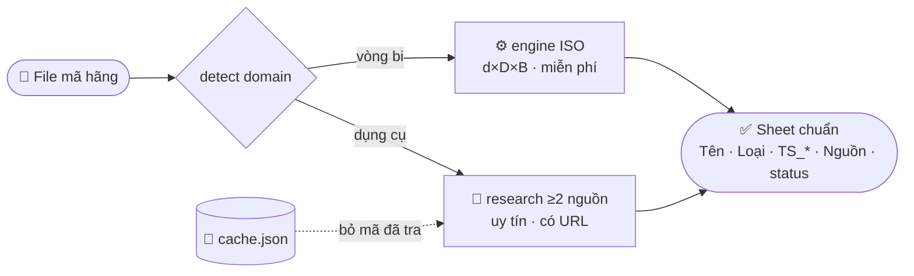

# 🏷️ naming-skills

> Danh sách **mã hãng** → **tên chuẩn + thông số kĩ thuật + category**.
> Chạy với **Claude Code · Codex · Gemini**. Nhanh · rẻ · không bịa · không lộ data.



---

## ⚡ Dùng nhanh


**Claude Code**
```
/plugin marketplace add nhattrung0911/naming-skills
/plugin install naming-skills@naming-skills
/naming @file.xlsx
```
**Codex / Gemini** → xem [AGENTS.md](AGENTS.md) (3 bước, cùng schema).
Chi tiết cài + gắn `category_id`: [INSTALLATION.md](INSTALLATION.md).

---

## 📥 Vào → 📤 Ra

| Mã hãng | → | Tên chuẩn | Loại | TS_* | Nguồn | status |
|---|---|---|---|---|---|---|
| `6205-2RS` | → | Vòng Bi Cầu Rãnh Sâu 25x52x15 mm 2 Nắp Chắn Cao Su 6205-2RS | Vòng Bi Cầu Rãnh Sâu | … | ISO | OK |
| `423024M` | → | Đầu Tuýp 24 mm 1/2 Inch Kingtony 423024M | Đầu Tuýp Lẻ | 1/2" · 24mm | kingtony; sata | OK |
| `41117` | → | Cờ Lê Vòng Miệng 17 mm Sata 41117 | Cờ Lê Vòng Miệng | 17 mm | sata.vn | OK |

`status = OK` ⇔ **≥2 nguồn khớp**. Thiếu/khó → `REVIEW`.

---

## 🚀 Nhanh & rẻ (đã tích hợp)

| | |
|---|---|
| 💾 **Cache** | lần sau chỉ tra mã mới → list lớn rất rẻ |
| ♻️ **Dedup** | mã trùng tự gộp |
| ⚙️ **Deterministic-first** | vòng bi mã chuẩn ra tên + d×D×B **không cần search** |
| ⛓️ **Batch + early-stop** | gộp mã theo lô, dừng ở 2 nguồn |

## 🔒 An toàn data
- Repo **0 id nội bộ**: `category_id` để trống tới khi bạn gắn `category_ids.local.json` (gitignored).
- Thông số = **search có nguồn**, KHÔNG bịa, KHÔNG suy từ format mã.

## 🧩 Gồm 3 skill
`/naming` (router) · `/naming-bearings` (vòng bi) · `/naming-handtools` (dụng cụ cầm tay).

## 📂 Cấu trúc
```
.claude-plugin/   marketplace.json · plugin.json
.claude/skills/   naming · naming-bearings · naming-handtools
AGENTS.md · GEMINI.md · INSTALLATION.md · requirements.txt
```

## 📋 Yêu cầu
Claude Code / Codex / Gemini (cho bước research) · Python 3 + `pandas` `openpyxl`.

## 📜 License
[MIT](LICENSE)
